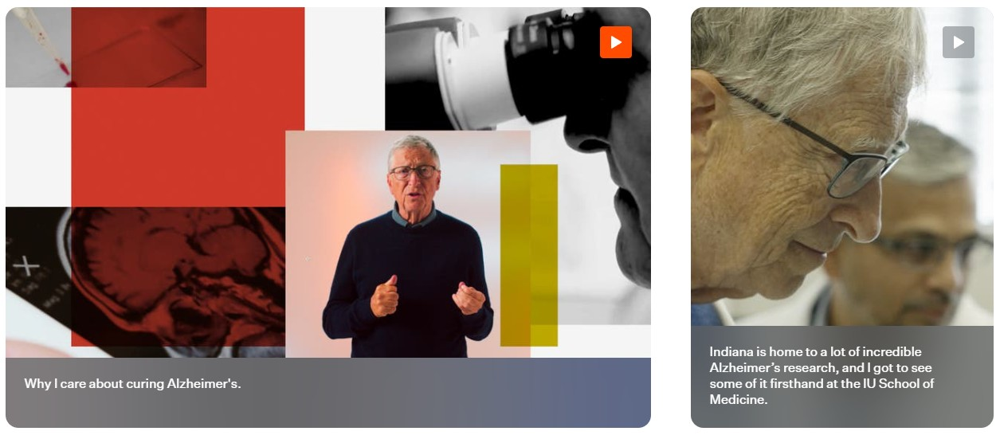
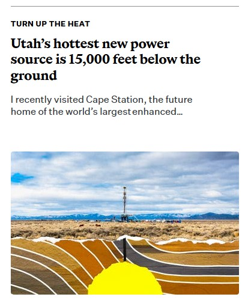
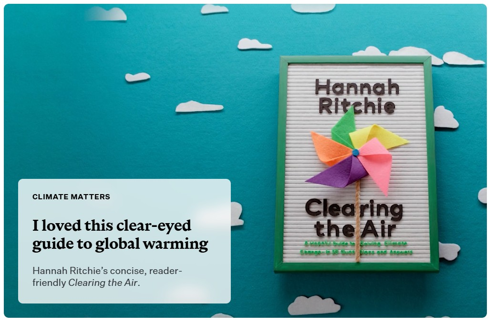

# Blog Site — Specification

**Version:** 0.9  
**Date:** April 14, 2026  
**Author:** James  
**Status:** Draft  

---
## Overview
This document defines the design, structure, and behavior of a personal blog website. It is intended as a complete specification for an LLM developer building the site. The site will serve approximately 20 readers at launch. It must be responsive (desktop and mobile), elegant, and reading-focused.

The website will not include an editor for blog posts, or any user-facing mechanism to schedule or post new articles. The blog posts will be generated in an external program as HTML files (one file per blog post). The blog site will use client-side code to incorporate and display the blog posts. 

The reference site is GatesNotes. This spec captures the patterns and principles that make that site work, adapted for a small personal blog with no commercial purpose. Wherever this document says "like GatesNotes," it means similar style choices and functionality.

This specification includes reference images in the docs/images/ directory. The implementor must examine all linked images before beginning implementation — they are part of the specification, not decoration.

---

## Part 1: What the Site Does


### 1.1 Purpose and Audience
The owner wants to replace social media as a way to stay in touch with friends and family. He also occasionally has fiction and non-fiction articles published on sites such as Medium, and wants a way to post about those successes. The owner is an avid reader and would like to share his reviews of books, movies, board games, and other products and experiences. The owner will also post YouTube videos that he creates, or that he just wants to share on his site. 

### 1.2 Site Map
The implementor shall define the URL patterns for all pages and document them in the table below. Proposed starting structure:

| Page | URL Pattern | Notes |
|------|-------------|-------|
| Home | `/` | Default landing page with article tiles. Navigation targets (Reviews, Videos) filter this page — they are not separate pages. Filter state carried in `?filter=<tag>` query param. |
| Article | `/posts/<slug>.html` | Individual article reading page |
| About | `/about.html` | Personal bio (future release — see 1.5) |
| Video overlay | `/video.html?v=<youtube-video-id>` | Full-screen YouTube player; close button returns to previous page |
| 404 | Any invalid URL | Error page (`404.html` at repo root; GitHub Pages serves this automatically) |

The implementor may modify this table as needed during implementation.

### 1.3 Home Page
The default landing page, showing all available articles as tiles in reverse chronological order. This will be an "infinite scroll", with on-demand loading of new articles as the user scrolls to the bottom of the list. 

When displayed on a large monitor, the home page will consist of a 3-column grid. Every row must sum to exactly 3 columns — no gaps. The tile layout follows a fixed repeating row pattern, applied automatically from newest to oldest:

- **Row 1:** one 3-column tile (**featured tile** — see below)
- **Row 2:** one 2-column tile, one 1-column tile
- **Row 3:** one 1-column tile, one 2-column tile
- **Row 4:** three 1-column tiles

This pattern consumes 8 articles per cycle, then repeats. Articles are always in reverse chronological order — the pattern controls the layout, not the manifest. The manifest does not contain column span information; it is determined entirely by the layout algorithm.

Every post (article and video) must render correctly at any width (1, 2, or 3 columns). All tiles in a row are the same height.

**Fixed tile height:** Tile row heights do not change as the viewport narrows. A tile that is 400px tall on desktop is still 400px tall on tablet and mobile. When the viewport narrows, tiles get narrower (and may reflow to fewer columns) but they do not get shorter. This ensures a consistent, usable reading experience across devices.

**Featured tile (Row 1 of each cycle):** The first tile in each cycle is wider and taller than standard tiles, but does not fill the entire screen. It fills the full width of the white content area (~1800px, wider than the ~1500px tile grid) and extends upward from the normal Row 1 bottom edge to the top of the white content area, passing behind the floating header. The extra height comes from reclaiming the space above — the bottom of the featured tile is in the same position as the bottom of a normal first-row tile would be. On subsequent cycles (rows 8, 15, etc.), the Row 1 tile uses the standard tile grid width and does not extend upward — only the very first tile on the page gets the featured treatment.

#### 1.3.1 Video-only Posts

The user will post videos in addition to article-type blog posts. The tile for videos will be structured the same for 1, 2, and 3-column wide display: A static image taken from the video will occupy the upper 5/6ths of the frame. The bottom of the frame will have a caption in black text on a light gray background. The caption text will be sans-serif. Clicking anywhere in the tile will open a page on my site that displays the videos. The background of this page will be black with a close icon in the upper-right corner of the page. Clicking the close icon will return the user to the previous page. Videos will be posted on YouTube. The page displaying them should block "related videos" from appearing when the video has ended, if possible.

The image below shows two examples of video-only tiles. 




#### 1.3.2 Blog Posts

All blog posts that are not video-only will include body text and at least one image.   

Here is an example of a blog post tile. 



The following will be present on all blog post tiles:

* **Overline:** An "eyebrow headline" or kicker to set context. In the example above, the Overline is "TURN UP THE HEAT." This will be in a sans-serif font on the tile. 
* **Headline:** The primary article title, rendered in a bold, high-contrast serif font. In the example: "Utah’s hottest new power source is 15,000 feet below the ground." This will be a serif font.
* **Summary:** A brief lead-in or excerpt that provides a preview of the content. In the example: "I recently visited Cape Station, the future home of the world’s largest enhanced..." This will be a sans-serif font. 
* **Featured Image:** A visual anchor for the article. The Featured image may be a Main Image or a Hero Image. See below for placement of the image. 

Clicking any text element on the tile will open the blog post. 

All posts will have a "main image" or a "hero image" (but not both). The image will be identified in the `manifest.json` file as either a main or a hero. The layout of the tile will vary based on the type of image (see below).


##### 1.3.2.1 Posts With Main Images

Posts that have a main image will display that image below the summary on its tile. See the example in "Section 1.3.2 Blog Posts". 


##### 1.3.2.2 Hero Image Blog Posts 

**When rendered at 2 or 3 columns:** The hero image fills the tile. The Overline, Headline, and Summary appear in a text overlay box.

**Text overlay width rule:** The text overlay box is always the width of one grid column, regardless of the tile's rendered column span. A 3-column tile has a 1/3-width text box. A 2-column tile has a 1/2-width text box.

**When rendered at 1 column:** Hero image tiles use the same layout as main image tiles — text on top (overline, headline, summary), image below. No overlay box. This applies on desktop when the layout pattern places a hero post in a 1-column slot, and on mobile/tablet when all tiles are 1-column.

Here is an example of a 2-column wide tile with a hero image:




### 1.4 Article Page
The main or hero image for the article will appear at the very top of the Article Page, with no gap between the header and the image. On scroll, the image passes behind the floating header. The image should fill the full width of the white content area (up to ~1800px, centered — see 2.2). On viewports narrower than 1800px, the image fills the full width of the white content area. On viewports narrower than the white content area, the image fills the full viewport width.

The Overline, Headline, and Summary will appear under the image within the 700px text column. On the Article page, the Overline will be in a sans-serif font, the headline in a serif font, and the summary in a sans-serif font.

The author's byline will appear under the summary: By James Cage, Published on <Day>, <Mmm>, <d>, <yyyy>. For example:

By James Cage, Published on Sunday, April 12, 2026.

The text of the article will follow with a two-line drop cap. The drop cap will be sans-serif, and the text will be serif. 


### 1.5 About Page
The About page will be implemented in a future release. It will contain a personal bio, a description of the blog's purpose, and contact information. For now, the navigation should not include an About link.

### 1.6 Error Page
If a site URL does not exist, the site will display an error page. The error page will have a white background with the header and footer visible. A large "404" graphic will appear in the center of the page, with the words, "Uh Oh. That page doesn't exist" in sans-serif font underneath. The 404 graphic should show the number "404" in bold sans-serif font in black. Here is an example of the 404 graphic:


### 1.7 Navigation

The header navigation bar contains the following links:

| Label | Behavior |
|-------|----------|
| *Site name (e.g., "James Cage")* | Returns to the home page with no filter applied. This is the site logo/name on the left side of the header, not a navigation link on the right. |
| Home | Returns to the home page with no filter applied. |
| Reviews | Filters the home page to show only articles tagged "Reviews." |
| Videos | Filters the home page to show only articles tagged "Videos." |

On desktop, all links are visible in the header bar. On tablet and mobile, links collapse into a hamburger menu (see 2.5 and 2.8).

The navigation link list may grow over time as new content categories emerge. The implementor should build the navigation so that adding a new filtered link requires only a change to a configuration list, not a code change.

### 1.8 Tagging and Filtering

Every article in `manifest.json` has a `tags` array. Tags are used for filtering but are not displayed on tiles or article pages — they are behind the scenes.

**Initial tag list:**

| Tag | Description |
|-----|-------------|
| Reviews | Book, movie, TV show, board game, and product reviews |
| Videos | Video-only posts |
| Music | Concert reports, album discussions, artist profiles |
| Publications | Articles and reviews I've published elsewhere |


Tags are not mutually exclusive — an article may have multiple tags (e.g., a board game review video would have both "Reviews" and "Videos").

**Filtering behavior:**

When a reader selects a navigation target (e.g., "Reviews"), the home page shows only articles whose `tags` array includes that tag, in reverse chronological order. Selecting "Home" or clicking the site name clears the filter and shows all articles. Filtering is implemented via URL query parameters (e.g., `/?filter=Reviews`).

New tags can be added to articles in the manifest at any time. A new tag only needs a corresponding navigation link (see 1.7) if the owner wants it to appear in the menu bar.

---

## Part 2: What the Site Looks Like

### 2.1 Design Philosophy

The site exists to be read. Every design decision serves the reading experience. These principles are non-negotiable:

**Content dominates.** No sidebars, no widgets, no social sharing buttons, no visual clutter competing with the article text. The page is the article. Everything else gets out of the way.

**Generous whitespace.** Space between elements creates calm. GatesNotes uses wide margins around a constrained content column, leaving the majority of the screen on desktop as breathing room. This is intentional, not wasted space. The blog should feel spacious, not packed.

**Minimal navigation.** The site has very few pages. Navigation should be a quiet presence — always available, never demanding attention. GatesNotes keeps its nav bar to a logo and a handful of links. This blog should have fewer.

**Warm and personal.** This is not a corporate site or a news outlet. The tone should feel like opening a letter, not visiting a storefront. Design choices — color warmth, font personality, casual image treatment — should reinforce that this is one person writing for people he knows.

**Images are integral, not decorative.** Every article includes at least one image (main or hero). Images should feel like a natural part of the content — well-integrated, properly sized, and given room to breathe — not bolted on as an afterthought.

### 2.2 Layout

The site uses a three-tier visual container model, like GatesNotes:

1. **Page background** (#FAFAFA light gray) — the outermost layer, always visible at the edges of wide screens. This is the "desk" the content sits on.
2. **White content area** (#FFFFFF) — a centered white container, max-width ~1800px. This is the "page." On wide screens, the light gray is visible to the left and right of this white area. As the window narrows, the gray disappears first. All site content (header, tiles, articles, footer) lives within this white area.
3. **Text column** (~700px) — centered within the white content area. Article body text is constrained to this width for comfortable reading (55-75 characters per line).

The white content area must be a visually distinct container — a white rectangle on the gray background, not an invisible wrapper. On screens narrower than ~1800px, the white area fills the viewport and the gray background is no longer visible.

**Article page layout:**
- Hero image: fills the full width of the white content area (~1800px max). Sits at the very top of the article, directly against or behind the floating header.
- Text column: maximum width of approximately 700px, centered within the white content area.
- On tablet, the text column widens slightly relative to the viewport but maintains comfortable side padding (32-40px).
- On mobile, the text column fills the viewport width with 16-24px of side padding.

**Home page layout:**
- The home page tile grid and the featured tile both sit within the white content area.
- **Featured tile (first tile):** fills the full width of the white content area (~1800px max) and extends upward from the normal Row 1 bottom edge to the top of the white content area, behind the floating header. It is wider and taller than standard tiles, but only because it reclaims the space above and to the sides — it does not extend downward past where a normal first-row tile would end.
- **Tile grid (rows 2+):** maximum width of approximately 1500px, centered within the white content area. This is wider than the article text column (~700px) but narrower than the white content area, leaving some white margin on either side of the grid on very wide screens.
- Tiles are arranged in a responsive grid: 3 columns on desktop, 2 on tablet, 1 on mobile.

**All pages share a common header and footer.** The content area between them varies by page type.

### 2.3 Typography

The site uses two font families: a serif for body text and headlines (matching the literary, warm personality in 2.1), and a sans-serif for overlines, summaries, navigation, captions, and metadata (matching GatesNotes' clean supporting text).

**Font families:**

- **Serif (headlines and body text):** Lora (Google Fonts). Lora is a well-balanced serif designed for screen reading, with good contrast and a warm personality. Fallback stack: `"Lora", Georgia, serif`.
- **Sans-serif (overlines, summaries, navigation, metadata, captions):** Inter (Google Fonts). Inter is a highly readable sans-serif designed for screens, with clean lines and neutral personality. Fallback stack: `"Inter", "Helvetica Neue", Arial, sans-serif`.

**Font loading:** Load both from Google Fonts with `font-display: swap` so text renders immediately with system font fallbacks.

| Element | Font | Size | Weight | Line height |
|---------|------|------|--------|-------------|
| Body text | Lora (serif) | 19px | Normal (400) | 1.65 |
| Article headline | Lora (serif) | 36px | Bold (700) | 1.15 |
| Overline | Inter (sans-serif) | 13px | Semi-bold (600), uppercase, letter-spacing 1px | 1.3 |
| Summary/excerpt | Inter (sans-serif) | 16px | Normal (400) | 1.5 |
| H2 in article | Lora (serif) | 26px | Bold (700) | 1.25 |
| H3 in article | Lora (serif) | 21px | Semi-bold (600) | 1.3 |
| Navigation links | Inter (sans-serif) | 15px | Normal (400) | — |
| Date/byline | Inter (sans-serif) | 14px | Normal (400) | 1.4 |
| Captions | Inter (sans-serif) | 14px | Normal (400) | 1.4 |
| Drop cap | Inter (sans-serif) | ~3.5em | Bold (700) | — |

**Text color:** Body text is dark gray (#333333) on an off-white background. Not pure black on pure white — the softer contrast reduces eye strain for sustained reading.

**Text alignment:** Always left-aligned. Never justified — justified text creates uneven word spacing on the web.

**Paragraph spacing:** 1.3em between paragraphs. No first-line indent — use space between paragraphs instead.

### 2.4 Color Palette

The site uses a restrained, GatesNotes-inspired palette. Color is used for links and occasional UI elements, not for decoration. There is no dark mode.

The page background and content area background work together to create visual depth (see 2.2). On wide screens, the light gray page background (#FAFAFA) is visible to the left and right of the white content area (#FFFFFF), framing the content like a page on a desk. This distinction must be visually apparent — the white content area is a real container, not just a color behind text.

| Role | Value | Notes |
|------|-------|-------|
| Page background | #FAFAFA | Light gray. The outermost layer — visible at edges on wide screens. |
| White content area | #FFFFFF | The centered "page" container, max-width ~1800px. All content lives here. |
| Tile background | #FFFFFF | Same as content area — tiles are distinguished by shadow, not color. |
| Body text | #333333 | Dark gray. Softer than pure black for sustained reading. |
| Headline text | #222222 | Slightly darker than body for emphasis through density, not color. |
| Muted text (dates, captions, metadata) | #888888 | Medium gray. Informational, not prominent. |
| Overline text | #555555 | Darker than muted, but not as strong as body text. |
| Links | #1A73E8 | Blue, similar to GatesNotes. Sufficient contrast on white/off-white. |
| Link hover | #0D47A1 | Darker blue on hover. |
| tile borders/shadows | `rgba(0,0,0,0.08)` | Very subtle box-shadow. Not a hard border. |
| tile hover shadow | `rgba(0,0,0,0.15)` | Slightly deeper on hover to indicate interactivity. |
| Header background | #FFFFFF | White, with a thin bottom border or subtle shadow. |
| Header border | #E0E0E0 | Thin 1px bottom border to separate from content. |
| Footer text | #999999 | Light gray. Understated. |
| Accent color | #1A73E8 | Same as link color. Used sparingly — links and active filter tags only. |

### 2.5 Header and Footer

**Header:**

GatesNotes uses a clean top bar with the site name/logo on the left and a small number of navigation links on the right. The header has a white or light background, a thin bottom border or subtle shadow, and does not demand attention.

- Site name or logo: left-aligned. Text-based is fine (no graphic logo needed). Set in the heading font at a moderate size — large enough to identify the site, not so large it dominates the page.
- Navigation links: right-aligned. Home, Reviews, Videos. See 1.7 for full link definitions. The link list should be configurable so new filtered links can be added without a code change.
- **Floating header:** The header floats above the content, fixed in place while scrolling. It is positioned 18px below the top of the viewport (`top: 18px`), constrained to `max-width: var(--max-tile-grid)` so it matches the tile grid width, and centered with `margin: 0 auto`. Rounded corners (`border-radius: 8px`) give it a contained, island-like appearance. No box-shadow — use only the thin bottom border. Content scrolls behind and around the header, visible in the gap above and to the left and right. The body or main content must have `padding-top` to account for the header being out of the document flow.
- On tablet and mobile: navigation links collapse into a hamburger menu icon (three horizontal lines). Tapping it reveals the links as a dropdown, slide-in panel, or full-screen overlay.

**Footer:**

GatesNotes has a relatively substantial footer with links, social icons, and newsletter signup. For this blog, the footer should be minimal:

- A single line or small block at the bottom of every page.
- Contents: copyright notice (e.g., "© 2026 James"), optionally a short personal tagline or favorite quote.
- Visual style: small text, generous top margin separating it from content above. Muted color. Not a dark contrasting band — keep it light and part of the page, not a separate zone.

### 2.6 Home Page Design

The tile content, structure, and layout behavior are defined in Section 1.3. This section covers only the visual styling of those tiles.

**Featured tile (first tile on the page):**
- Fills the full width of the white content area (~1800px) and extends upward to the top of the white content area, behind the floating header.
- No border, no shadow, no rounded corners — it bleeds to the edges of the white content area at the top and sides.
- The tile's hero/main image fills the entire tile area. The text overlay box (overline, headline, summary) follows the same width rule as other hero tiles (see 1.3.2.2) but may use larger text given the extra space.

**Standard tile styling (rows 2+):**
- White background (#FFFFFF) on the off-white page (#FAFAFA) to create subtle tile lift.
- Subtle box-shadow (`rgba(0,0,0,0.08)`) to define tile boundaries. Shadow deepens on hover (`rgba(0,0,0,0.15)`) with a slight upward lift to indicate interactivity.
- Overline text: Inter sans-serif, 13px, semi-bold, uppercase, letter-spacing 1px, color #555555.
- Headline text: Lora serif, bold, color #222222. Size varies by column span — larger for 2- and 3-column tiles.
- Summary text: Inter sans-serif, 16px, normal weight, color #333333.
- Date or metadata on tiles (if shown): Inter sans-serif, 14px, color #888888.

**Hero image tile text overlay (see 1.3.2.2):**
- The gray overlay box containing the overline, headline, and summary should have a semi-transparent background (e.g., `rgba(245,245,245,0.92)`) so the hero image remains visible behind it.

**Filter controls:**
Filtering is handled through navigation targets in the header bar (see 1.7). Tags are behind the scenes — assigned in the manifest, not displayed on tiles. When a reader selects a navigation target, the home page filters to show only articles with the matching tag.

### 2.7 Article Reading Experience

This is the most important page on the site. GatesNotes gives articles a clean, distraction-free reading environment. The blog should do the same.

**Article header:**
The article page structure is defined in Section 1.4. The visual styling:
- Main or hero image: fills the full width of the white content area (~1800px max) at the top of the page, behind the floating header. See 1.4 and 2.2.
- Overline: Inter sans-serif, 13px, semi-bold, uppercase, letter-spacing 1px, color #555555. Below the image.
- Headline: Lora serif, 36px, bold, color #222222. Below the overline.
- Summary: Inter sans-serif, 16px, normal weight, color #333333. Below the headline.
- Byline: Inter sans-serif, 14px, normal weight, color #888888. Below the summary.
- "Originally published" note (if present): Inter sans-serif, 14px, italic, color #888888. Below the byline.

**Body text:**
- Left-aligned, in Lora serif at the sizes and line heights specified in 2.3.
- Paragraphs separated by 1.3em whitespace, no first-line indent.
- The reading column is the constrained 700px width described in 2.2.

**Block quotes:**
- Visually distinct from body text. GatesNotes uses a left border accent.
- Recommended: a 3-4px left border in the accent color or a muted gray, with the text slightly indented (20-40px left padding). Text may be in italic or in a slightly different color to differentiate from the author's voice.
- Block quotes should feel like a pause — a different voice — not just indented body text.

**Inline images:**
- Display at full content column width.
- Optional caption below in 14px muted text.
- Images should have explicit width and height attributes to prevent layout shift during loading.

**Inline links:**
- Clearly distinguishable from body text. Use the accent color, with either a persistent underline or an underline that appears on hover.
- Visited links may shift to a slightly muted shade of the accent color. *[OPTIONAL.]*

**Lists (bulleted and numbered):**
- Standard indentation. Adequate spacing between items (at least 0.5em) so items don't feel cramped.
- Bullet style: a simple disc or circle. Numbered lists use standard numerals.

**Code blocks (if ever used):**
- Monospaced font (system monospace stack is fine).
- Subtle background color (e.g., light gray) to distinguish from body text.
- Horizontal scroll if the content is too wide for the column.
- Inline code (within a sentence) also gets the monospaced font and a subtle background.

**Horizontal rules:**
- Used sparingly to indicate major section breaks within an article.
- Thin, muted, centered. Not a heavy black line.

**Article footer area:**
- A subtle visual break (whitespace or a light horizontal rule) between the end of the article and the page footer.

### 2.8 Responsive Behavior

The site must work well on three device classes. GatesNotes handles this smoothly — the layout reflows without feeling like a different site on each device.

**Desktop (viewport width > 1024px):**
- Article content column: ~700px, centered with large side margins.
- Home page tile grid: ~1500px, centered within the white content area. Featured tile fills full white content area width.
- Article tiles in 2-3 column grid.
- Navigation links visible in header.
- Full hover effects on tiles and links.

**Tablet (viewport width 768px–1024px):**
- Article content column fills more of the width; side margins shrink but remain comfortable (32-40px).
- Home page tile grid reduces to 2 columns.
- Tile heights remain the same as on desktop — tiles get narrower, not shorter.
- Hero image tiles in 1-column slots switch to main image layout (text on top, image below — see 1.3.2.2).
- Navigation collapses to hamburger menu (matching GatesNotes behavior on tablet).
- Touch-friendly tap targets (minimum 44px height).

**Mobile (viewport width < 768px):**
- Article content column fills viewport with 16-24px side padding.
- Home page tiles stack in a single column.
- Tile heights remain the same as on desktop.
- All hero image tiles use main image layout (text on top, image below) since all tiles are 1-column.
- Navigation collapses to hamburger menu.
- Font sizes may decrease slightly but body text must not go below 16px.
- Touch-friendly tap targets throughout.
- No hover effects (hover is not meaningful on touch devices). Interactive feedback comes from active/pressed states instead.

**Breakpoint strategy:** Use CSS media queries at 768px and 1024px. Design mobile-first — the base CSS should be the mobile layout, with media queries adding complexity for larger screens.

### 2.9 Image Handling

**Hero images:**
- Displayed at full content-column width on the article page.
- Displayed large on the home page for the featured article.
- Displayed as thumbnails in article tiles.
- Aspect ratio preserved always — never stretched or cropped to fit a fixed container unless specifically designed for that (e.g., a fixed-ratio tile thumbnail may crop).
- All hero images should have descriptive `alt` text.

**Inline images (within article body):**
- Full content-column width by default.
- Optional caption below.
- Responsive: `max-width: 100%` so they scale down on small screens.
- Must include `width` and `height` attributes in the HTML to prevent layout shift.

**Image formats:**
- JPEG for photographs. WebP as a progressive enhancement if supported by the serving infrastructure.
- PNG for screenshots or graphics with sharp edges.
- All images should be reasonably optimized for file size before uploading.

### 2.10 Accessibility

**Color contrast:**
- All text must meet WCAG AA contrast ratios: 4.5:1 for body text (under 18px or under 14px bold), 3:1 for large text (18px+ or 14px+ bold).
- After the color palette is finalized, verify all text/background combinations with a contrast checker tool. The design consultation LLM should be asked to verify this.

**Semantic HTML:**
- Use proper HTML5 elements: `<header>`, `<nav>`, `<main>`, `<article>`, `<section>`, `<footer>`.
- One `<h1>` per page (the article title on article pages, the site name or "Recent Articles" on the home page).
- Heading levels must not skip (no jumping from H1 to H3).
- Navigation should be wrapped in `<nav>` with an `aria-label`.

**Keyboard navigation:**
- All interactive elements (links, buttons, filter controls, hamburger menu) must be reachable and operable via keyboard Tab/Enter/Space.
- Focus indicators must be visible — do not remove the browser's default focus outline without providing a styled alternative.

**Images:**
- All content images must have descriptive `alt` text.
- Decorative images (if any) must have `alt=""` so screen readers skip them.

**Font sizing:**
- Use relative units (`rem` or `em`) for font sizes so users can override with browser settings.
- Do not set a fixed pixel font-size on the `<html>` or `<body>` element that would prevent user scaling.

**Motion:**
- If any animations or transitions are used (e.g., tile hover effects), they should respect `prefers-reduced-motion` by providing a static alternative.

---

## Part 3: How It's Built

### 3.1 Technology Stack

The site is a static site hosted on GitHub Pages. There is no server-side code. The implementor shall select and document all libraries, frameworks, and tools used below:

| Component | Choice | Notes |
|-----------|--------|-------|
| Hosting | GitHub Pages | Served from the `JamesDCage.github.io` repository |
| CSS framework (if any) | None — vanilla CSS | Mobile-first, custom properties, CSS Grid |
| JavaScript libraries (if any) | None — vanilla JS | ES5-compatible IIFEs; no build step required |
| Font source | Google Fonts (Lora, Inter) | Loaded with `font-display: swap`; see 2.3 |

The implementor may add rows to this table as needed.

### 3.2 Project Directory Structure

The following directory structure is proposed, however, the implementor will have freedom to add directories and files as needed. Any additions or changes must be documented here by the implementor. 

PRIME DIRECTIVE: The `JamesDCage.github.io/img` directory and its existing contents must NOT be modified, renamed, added to, or deleted under any circumstances!!!

```
JamesDCage.github.io/
├── index.html           # Homepage (shell; tiles rendered by home.js)
├── manifest.json        # Global site data for client-side JS-driven filtering
├── video.html           # Full-screen YouTube video player page
├── 404.html             # Error page
├── CLAUDE.md            # Developer guide for LLM/human contributors
├── img/                 # [SYSTEM RESERVED] - DO NOT MODIFY!!
├── assets/              # Global site-wide design assets
│   ├── css/
│   │   └── main.css     # All styles: typography, layout, components (mobile-first)
│   └── js/
│       ├── nav.js       # Navigation: renders nav links from config, hamburger toggle
│       └── home.js      # Home page: fetches manifest, renders tile grid, filtering, infinite scroll
└── posts/               # All blog content
    ├── images/          # Images specific to blog posts
    │   └── <slug>-<name>.jpg|png
    └── <slug>.html      # One complete HTML file per blog post
```

**Added files vs. proposal:** `video.html` and `404.html` were added at the root. `router.js` was renamed and split into `nav.js` (navigation only) and `home.js` (home page only), following the single-purpose module principle in 3.5. `CLAUDE.md` added at root for developer onboarding.

**CSS custom property key values (defined in `main.css` `:root`):**

| Property | Value | Role |
|----------|-------|------|
| `--max-content` | 1800px | White content area max-width |
| `--max-tile-grid` | 1500px | Home page tile grid max-width |
| `--max-article` | 700px | Article text column max-width |
| `--tile-height` | 420px | Fixed tile height (never changes with viewport) |
| `--header-height` | 60px | Height of the floating header bar |
| `--header-offset` | 96px | Body padding-top (18px gap + 60px header + 18px gap) |

### 3.3 manifest.json Structure, Contents, and Role

The manifest file lists all available blog posts with the metadata needed for sorting, filtering, and rendering tiles on the home page. The client-side JavaScript reads this file to build the home page dynamically.

The implementor may add fields to this structure but must update this document if so. Fields must not be removed without updating the specification.

**Field definitions:**

| Field | Type | Required | Description |
|-------|------|----------|-------------|
| `title` | string | Yes (for articles) | The article headline displayed on the tile and article page. Not used for video posts. |
| `overline` | string | Yes (for articles) | The eyebrow headline / kicker displayed above the title (e.g., "TURN UP THE HEAT"). Not used for video posts. |
| `summary` | string | Yes (for articles) | A 1-2 sentence excerpt displayed on the tile below the headline. Not used for video posts. |
| `slug` | string | Yes | URL-safe identifier. Must match the HTML filename (without extension). |
| `date` | string (YYYY-MM-DD) | Yes | Publication date, used for reverse-chronological sorting. |
| `tags` | array of strings | Yes | Category tags for filtering (e.g., `["Reviews", "Books"]`). See 1.8. |
| `url` | string | Yes | Relative path to the HTML file (e.g., `/posts/2026-04-10-gatsby-review.html`). |
| `type` | string | Yes | Either `"article"` or `"video"`. Determines tile rendering behavior. |
| `image_url` | string | Yes | Relative path to the featured image (e.g., `/posts/images/gatsby-cover.jpg`). |
| `image_type` | string | Yes (for articles) | Either `"main"` or `"hero"`. Determines tile layout per 1.3.2.1 and 1.3.2.2. Not used for video posts. |
| `video_url` | string | Yes (for videos) | YouTube embed URL. Only used when `type` is `"video"`. |
| `video_caption` | string | Yes (for videos) | Caption displayed at the bottom of the video tile. Only used when `type` is `"video"`. |
| `originally` | string | No | If the article was first published elsewhere, a short attribution note (e.g., "Originally published on Medium"). |

**Example:**

```json
[
  {
    "title": "Utah's hottest new power source is 15,000 feet below the ground",
    "overline": "TURN UP THE HEAT",
    "summary": "I recently visited Cape Station, the future home of the world's largest enhanced geothermal system.",
    "slug": "2026-04-10-future-of-energy",
    "date": "2026-04-10",
    "tags": ["Publications"],
    "url": "/posts/2026-04-10-future-of-energy.html",
    "type": "article",
    "image_url": "/posts/images/2026-04-10-solar-panel.jpg",
    "image_type": "hero"
  },
  {
    "title": "Review: The Great Gatsby",
    "overline": "ON MY NIGHTSTAND",
    "summary": "Fitzgerald's jazz-age masterpiece holds up better than I expected on a second reading.",
    "slug": "2026-04-05-gatsby-review",
    "date": "2026-04-05",
    "tags": ["Reviews"],
    "url": "/posts/2026-04-05-gatsby-review.html",
    "type": "article",
    "image_url": "/posts/images/2026-04-05-book-cover.png",
    "image_type": "main"
  },
  {
    "slug": "2026-03-28-shinyribs-live",
    "date": "2026-03-28",
    "tags": ["Videos", "Music"],
    "url": "",
    "type": "video",
    "image_url": "/posts/images/2026-03-28-shinyribs-thumb.jpg",
    "video_url": "https://www.youtube.com/embed/dQw4w9WgXcQ",
    "video_caption": "The best show I saw in 2025 was a wild band from Austin, Texas -- Shinyribs!"
  }
]
```


### 3.4 Blog Post Structure and Tags

Blog posts will have HTML tags, but no style information. All styles will be defined in one or more CSS files.

Each blog post is a **complete, standalone HTML page** (`/posts/<slug>.html`) that links to the shared CSS and nav JS. The external blog management program generates these files from Markdown source; the structure below is the contract between that program and the site's CSS.

**Page skeleton:**

```html
<!DOCTYPE html>
<html lang="en">
<head>
  <!-- charset, viewport, title, meta description -->
  <!-- Google Fonts preconnect + stylesheet link -->
  <link rel="stylesheet" href="/assets/css/main.css">
</head>
<body data-page="article">
  <!-- shared <header> with site-header / site-nav markup (identical across all pages) -->
  <div class="content-area">
    <main class="article-main">
      <article class="post-article">
        <!-- featured image, post header, divider, post body -->
      </article>
    </main>
    <!-- shared <footer> -->
  </div><!-- /.content-area -->
  <script src="/assets/js/nav.js"></script>
</body>
</html>
```

**`.content-area` wrapper:** Required on all pages (except `video.html`, which has a full-screen black background). Provides the centered white (#FFFFFF) content rectangle that sits on the gray (#FAFAFA) page background. Max-width: 1800px, horizontally centered. The `<header>` (fixed/floating) is placed *outside* the `.content-area` so it overlays everything at `z-index: 100`.

**Article content tags and their CSS classes:**

| Tag | Class / Role | Notes |
|-----|-------------|-------|
| `<div class="post-featured-image">` | Featured image wrapper | Full content-column width; contains one `` |
| `` inside featured image | — | Must include `width`, `height`, and `alt` attributes |
| `<header class="post-header">` | Article metadata block | Contains overline, title, summary, byline |
| `<p class="post-overline">` | Overline / eyebrow headline | Inter sans-serif, 13px, semi-bold, uppercase |
| `<h1 class="post-title">` | Article title (one per page) | Lora serif, 36px, bold |
| `<p class="post-summary">` | Summary / excerpt | Inter sans-serif, 16px |
| `<p class="post-byline">` | Author and publication date | Inter sans-serif, 14px, muted color |
| `<p class="post-originally">` | Optional "originally published" note | Inter sans-serif, 14px, italic, muted (omit element if unused) |
| `<hr class="post-divider">` | Divider between header and body | Thin horizontal rule |
| `<div class="post-body">` | Article body content wrapper | All body prose lives here; drop cap applied to first `<p>` via CSS |
| `<p>` | Body paragraph | Lora serif, 19px; first `<p>` receives drop cap via `::first-letter` |
| `<h2>` | Section heading | Lora serif, 26px, bold |
| `<h3>` | Sub-section heading | Lora serif, 21px, semi-bold |
| `<ul>` / `<ol>` + `<li>` | Bulleted / numbered list | Standard indentation; 0.5em between items |
| `<blockquote>` | Pull quote | Left border accent in link color; indented |
| `<figure>` | Inline image wrapper | Contains `` and optional `<figcaption>` |
| `` inside figure | — | Must include `width`, `height`, and `alt` attributes |
| `<figcaption>` | Image caption | Inter sans-serif, 14px, italic, muted |
| `<hr class="post-end-rule">` | End-of-article divider | Separates article from page footer |
| `<a>` | Inline link | Link color (#1A73E8) with underline |
| `<code>` | Inline code | Monospace, light gray background |
| `<pre><code>` | Code block | Monospace, light gray background, horizontal scroll |
| `<hr>` (inside post-body) | Section break | Thin, centered, muted |


### 3.5 Single-Purpose Module Design

Modules should do one thing and do it well. A developer reading a module's filename and docstring should know what it contains without opening it. A developer opening it should be able to read it in one sitting.

**Principles:**

**Each module has a single, stated purpose.** The module docstring declares what the module is responsible for. If the docstring requires the word "and," the module is probably doing two things. For example, a module that "manages article loading" is focused; a module that "manages article loading and renders the home page" should be two modules.

**Modules communicate through public interfaces.** A module exposes a small set of public methods or classes. Other modules call those methods rather than reaching into internal state, private attributes, or widget hierarchies. This means a module can be rewritten internally without breaking its callers.

**Dependencies flow in one direction.** A module receives what it needs — through constructor arguments, method parameters, or callbacks — rather than importing and accessing other modules' internals. When module A needs something from module B, it should be clear from A's constructor or function signatures, not hidden in the middle of a method body.

**Keep modules short enough to read as a unit.** There is no hard line count, but when a module grows long enough that a developer loses track of its contents, it should be split. As a practical guideline, a module over 300 lines likely contains more than one purpose. A module under 50 lines may not justify its own file. These are signals to reconsider, not rules to enforce.

**The application entry point reads like a table of contents.** The top-level module should show what the application is made of — what components exist, how they connect, and what starts the application. Implementation details live in the modules it references. A new developer reading only this file should understand the application's structure.

---

## Appendices

### A. Design Decisions

All design decisions have been resolved and are documented in the body of this specification. The following table provides a quick reference:

| Decision | Resolution | Section |
|----------|-----------|---------|
| Floating header | Fixed 18px from top, content-width, rounded corners, no shadow | 2.5 |
| Tile grid layout | Fixed repeating row pattern: (3), (2,1), (1,2), (1,1,1). No column_span in manifest. | 1.3 |
| Body font | Lora (serif) for body/headlines, Inter (sans-serif) for supporting text | 2.3 |
| Dark mode | No | 2.4 |
| Hamburger on tablet | Yes — collapses on tablet and mobile | 2.5, 2.8 |
| Previous/Next links | No | 2.7 |
| Article metadata format | Separate manifest.json file | 3.3 |
| Tag filter mechanism | URL parameters (`?filter=<tag>`) | 1.2, 1.8, 2.6 |

### B. Out of Scope
Features handled by the separate local management application, not by this website:

- Newsletter generation and sending
- Subscriber management
- Article tracking (which articles have been published, sent in newsletters, etc.)
- Markdown to HTML conversion and preview
- Content publishing

### C. Revision History

| Version | Date | Changes |
|---------|------|---------|
| 0.0 | 2026-04-01 | Structure draft — headings only |
| 0.1 | 2026-04-01 | Added Part 1.1 content, Part 3 content, section descriptions |
| 0.2 | 2026-04-06 | Changed from Flask to Django. Populated Part 2 from GatesNotes analysis. Added open design decisions appendix. |
| 0.3 | 2026-04-12 | Resolved open design decisions. Set fonts (Lora serif + Inter sans-serif), color palette, sticky header, tablet hamburger, no dark mode, no prev/next links. Cleaned up Part 2 throughout. |
| 0.4 | 2026-04-12 | Populated 1.2, 1.5, 1.7, 1.8. Expanded manifest.json with full field definitions. Eliminated Part 1/Part 2 redundancies. Updated 2.1 (all posts have images). Fixed section numbering and typos. |
| 0.5 | 2026-04-12 | Fixed site map (Reviews is filtered home page, not separate page). Updated 2.5 nav links to match 1.7. Fixed manifest example tags to match 1.8. Removed value ranges in 2.7 in favor of cross-references to 2.3. |
| 0.6 | 2026-04-13 | Implementor update: filled in 3.1 (technology stack), updated 3.2 (directory structure — added video.html, 404.html, split router.js into nav.js + home.js), updated 1.2 (resolved video overlay URL and 404 URL patterns), filled in 3.4 (blog post HTML tag reference). No spec decisions changed. |
| 0.7 | 2026-04-13 | Applied review notes: replaced manual column_span with fixed row pattern (3),(2,1),(1,2),(1,1,1) in 1.3. Removed column_span from manifest schema and examples in 3.3. Added text overlay width rule to 1.3.2.2. Added hero image full-width (~1200px) rule to 1.4. Changed header to floating style (18px top, content-width, rounded corners) in 2.5. Resolved tag filter as URL parameters in 1.8 and Appendix A. Updated manifest fields: title/overline/summary required only for articles. |
| 0.8 | 2026-04-13 | Implementor update: fresh generation of all content. Copied docs/sample-content/manifest.json to repo root. Generated HTML files in /posts/ for all 4 article posts; video posts get no HTML page. Copied all images to /posts/images/. Fixed all bugs from BUGS_V0_0.md: floating header (CSS — uses `left:50%/translateX(-50%)` since `margin:0 auto` does not apply to fixed elements), tile layout pattern (home.js — `LAYOUT_PATTERN=[3,2,1,1,2,1,1]`), hero overlay width (CSS — mobile:100%, tablet span-2/3:50%, desktop span-3:33.33%), article hero full-width breakout (CSS — `width:min(100vw,1200px); margin-left:calc(50% - min(50vw,600px))`), drop cap font confirmed Inter, drop cap size 4.5em→3.5em, video tile min-height replaces broken `height:100%`. Nav links in article pages delegated to nav.js (no hardcoding). |
| 0.9 | 2026-04-14 | Added three-tier visual container model to 2.2. Updated 1.4: hero image fills full white content area width (~1800px). Updated 2.4: clarified page/content background relationship. Added featured tile behavior to 1.3. Increased tile grid width to ~1500px. Added featured tile styling to 2.6. Updated 2.7 and 2.8. Added rule: 1-column tiles always use text-on-top/image-below layout, no hero overlay (1.3.2.2). Added rule: tile row heights are fixed across all viewport widths (1.3, 2.8). |
