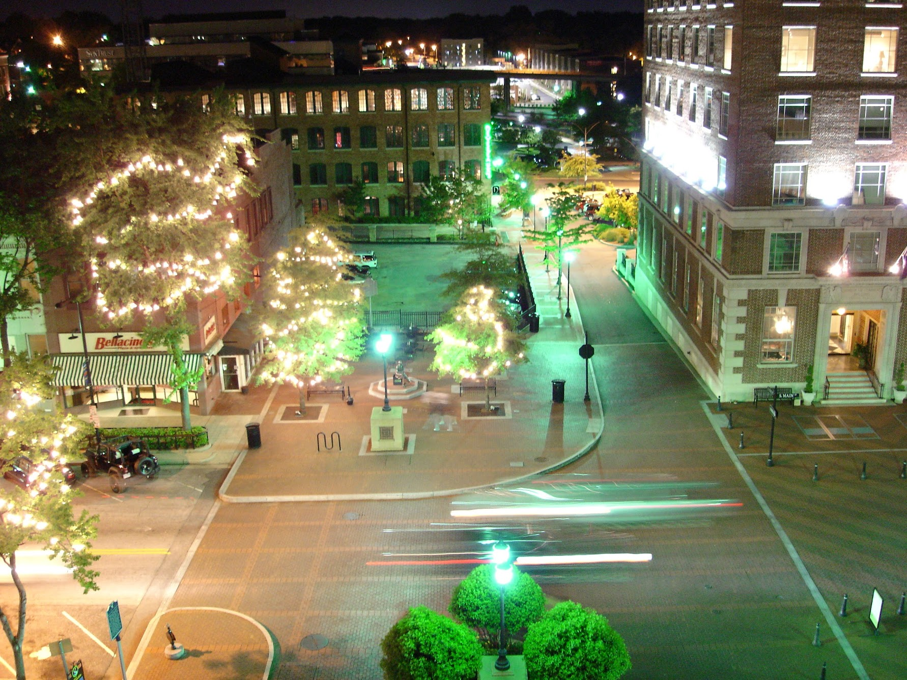

I'm in Greenville SC this week. The city has rebuilt its downtown — I can honestly say I have never seen a more beautiful city.

I'm staying in a hotel within walking distance from the city's minor-league ballfield, an amazing park, and about 100 good restaurants. Seriously, it's heaven. For months, I've been hearing this voice in my head: "You could do your job from here ..."

I took several pictures from my hotel room and posted them on Flickr. The one here is a night shot, a very long exposure. The streak of light on the right is a car driving into the frame.
