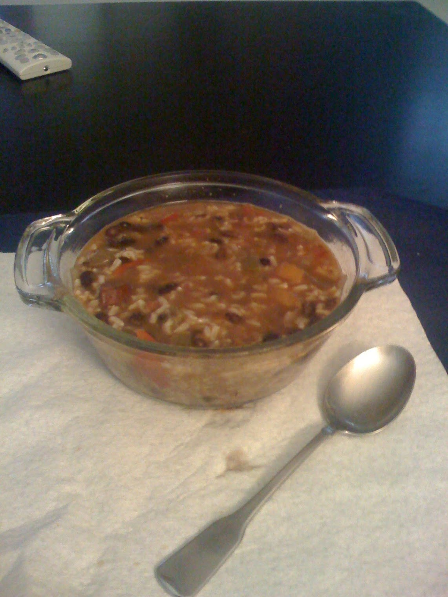

I've been batch cooking soups on Sundays for about six months now, and this one has become the staple. It's cheap, it freezes well, and it's one of those rare recipes where the leftovers taste better than the original.

## Ingredients

- 1 lb dried black beans, soaked overnight
- 1.5 lbs pork shoulder, cut into 1-inch cubes
- 1 large onion, diced
- 4 cloves garlic, minced
- 2 cans fire-roasted diced tomatoes
- 4 cups chicken broth
- 2 tsp cumin
- 1 tsp smoked paprika
- Salt and pepper to taste
- Olive oil

## Method

Brown the pork in batches in a heavy pot — don't crowd the pan or it steams instead of searing. Set the pork aside, soften the onion in the same pot, then add the garlic and spices for about a minute until fragrant.

Add everything else. Bring to a boil, then reduce to a low simmer for two hours. The beans should be completely tender and the pork should fall apart when you press it with a spoon.

I portion this into 6 containers. Each serving comes out to roughly 345 calories with 28g of protein — solid numbers for a meal that takes almost no active effort.

## Notes

The smoked paprika is non-negotiable. Regular paprika doesn't do the same thing. If you have a chipotle pepper in adobo, throw one in — it adds a smoky heat that works perfectly here.
