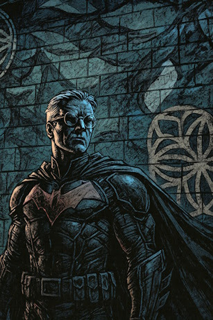

As I write this, yet another actor has been selected for a Superman movie sequel / reboot. But they get Superman wrong almost every time. I read once that that the same amount of pain hurts more when you know that a human being is inflicting it intentionally. For a long time, I thought that’s why Batman wears the suit. Sort of, “I really am going to hurt you. I’ve been looking forward to it. In fact, it’s such a big part of my day, I even dress up.” 

But I was wrong. He wants a thug to be in pain, and afraid, and above all, helpless. Batman never connects the dots, never points out that he's making the thug feel like the people the thug terrorizes. He knows there's no point. The criminal will either realize that himself, or he won't. He'll change, or he won't. Batman is just giving him a chance because he's trying to save the victim and the villain. In some messed up way, he's a missionary.

Batman knows that not every problem can be solved by beating the hell out of it and it kills him. And it WILL kill him. He’s going to keep doing this until someone puts a 45 through his forehead. He knows it, but he won’t stop because he can’t. He doesn’t want to die, but he can’t quit until the war is over. And that war will never be over. 

Superman wears the suit because his mom made it for him. The suit isn’t there to scare anyone. It’s for the people he loves, which is everybody. When Superman flies over the country, he likes to stop for a few minutes, maybe buzz a school or play a little baseball with the kids at recess. He likes to make their day. It’s the same reason he’ll let some thug shoot him a few times before wrapping him in a steel bar and giving him to the cops. The guy’s going to jail for the next twenty years. Give him a story to tell the other inmates. Let him keep his pride. 

Superman has millions of friends. Not just because they love him, but because he loves them back. He doesn’t even hate the criminals and villains he fights. Batman only has one real friend. No, not Robin – he's a joke. Not Alfred. Even if Alfred exists, he’s the employee, and Bruce Wayne is the employer, and that’s that. No, Batman’s only real friend is Superman. 

Superman likes being a hero. He likes the powers – they’re fun. He likes giving people hope, saving lives, seeing people at their best. But if Superman lost his powers and had to work bagging groceries, it wouldn’t really bother him. He would be the guy who always has a smile for you, who never gets upset about anything, who gets to know everyone who comes through the store, at least a little.

Hollywood gets Batman. But as far as I can see, they can’t quite get their heads around Superman. He isn’t a flawed hero. He isn’t carrying a secret pain. He isn’t being crushed by the burden of who he is. Superman is your big brother. Superman is your dad. 

What the next director of a Superman movie needs to understand is that when he fights a villain, of course it’s going to be for the fate of the world. That’s not why the audience cares. If Superman is alive, we know that somebody cares about us. 

We are afraid that if Superman dies, we will be alone.